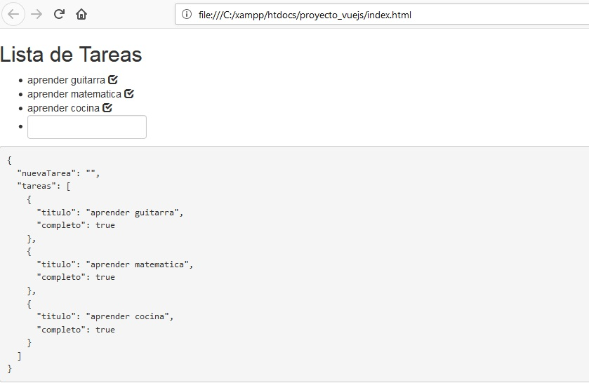

# Proy-VueJs.ListaDeTareas

Ejercicio de uso de VueJS realizando en html una lista de tareas y confirmar si son completadas o no, poder agregar 
desde un cuadro de texto nuevas tareas que, por default, se muestran sin terminar y una muestra de los datos del script.

